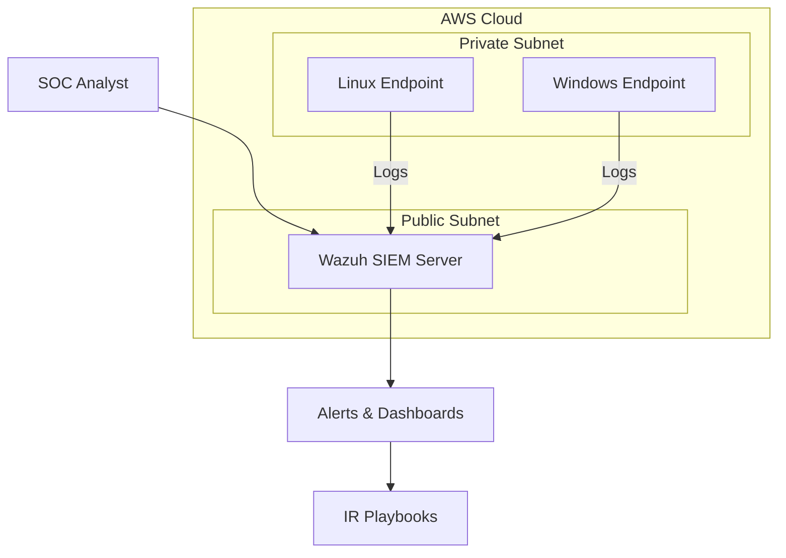

# 🛡️ Cloud SOC Platform

[](https://aws.amazon.com/)
[](https://www.terraform.io/)
[](https://wazuh.com/)
[](https://attack.mitre.org/)
[](ai-analyst/)
[](detections/04-macos-attacks.md)
[](LICENSE)

> **A production-ready Cloud Security Operations Center (SOC) built with Infrastructure as Code, featuring 73 MITRE ATT&CK-mapped detection rules across Windows, Linux, and macOS, AI-powered alert analysis, automated attack simulations, and comprehensive incident response playbooks.**

---

## 📋 Table of Contents

- [Overview](#-overview)
- [Features](#-features)
- [Architecture](#-architecture)
- [Quick Start](#-quick-start)
- [Project Structure](#-project-structure)
- [Detection Rules](#-detection-rules)
- [Attack Simulations](#-attack-simulations)
- [Incident Response](#-incident-response)
- [AI Alert Analyst](#-ai-alert-analyst)
- [Documentation](#-documentation)
- [Metrics & KPIs](#-metrics--kpis)
- [Skills Demonstrated](#-skills-demonstrated)
- [Contributing](#-contributing)
- [License](#-license)

---

## 🎯 Overview

This project demonstrates the design and implementation of a **complete Cloud Security Operations Center** using modern DevSecOps practices. Built entirely with Infrastructure as Code (Terraform), it deploys a fully functional security monitoring environment on AWS with Wazuh SIEM, custom detection rules, attack simulation capabilities, and incident response procedures.

### 💡 Key Highlights

- **73 Custom Detection Rules** mapped to MITRE ATT&CK framework
- **Multi-Platform Support**: Windows, Linux, and macOS detection
- **AI-Powered Alert Analysis** with LLM integration for intelligent triage
- **Automated Attack Simulations** based on Atomic Red Team
- **Complete Incident Response Playbooks** following NIST SP 800-61r2
- **Infrastructure as Code** with Terraform for reproducible deployments
- **Comprehensive Documentation** including architecture diagrams

### 🎓 Who Is This For?

- **Security Professionals** looking to build a home lab or learn detection engineering
- **SOC Analysts** wanting to understand end-to-end SOC operations
- **DevSecOps Engineers** interested in security automation
- **Students** preparing for security certifications or job interviews
- **Hiring Managers** evaluating security engineering skills

---

## ✨ Features

### 🏗️ Infrastructure
| Feature | Description |
|---------|-------------|
| **AWS VPC** | Isolated network with public/private subnets |
| **Wazuh SIEM** | Enterprise-grade security monitoring platform |
| **Linux Endpoint** | Ubuntu 22.04 with Wazuh agent |
| **Windows Endpoint** | Windows Server 2022 with Wazuh agent |
| **Terraform IaC** | Reproducible, version-controlled infrastructure |

### 🔍 Detection Engineering
| Feature | Description |
|---------|-------------|
| **73 Detection Rules** | Production-ready Wazuh rules |
| **Multi-Platform** | Windows, Linux, macOS support |
| **MITRE ATT&CK Mapping** | 11 tactics, 50+ techniques covered |
| **Compliance Mapping** | PCI DSS, NIST, GDPR, HIPAA |
| **< 2 min MTTD** | Mean Time to Detect target |

### 🍎 macOS Support
| Feature | Description |
|---------|-------------|
| **28 Detection Rules** | macOS-specific detections |
| **Persistence** | Launch Agents, Daemons, Login Items |
| **Credential Access** | Keychain, Safari, Chrome |
| **Defense Evasion** | Gatekeeper, SIP, TCC bypass |
| **Attack Simulation** | Purple team testing script |

### 🔴 Attack Simulation
| Feature | Description |
|---------|-------------|
| **Atomic Red Team** | Framework-based attack simulations |
| **15+ Scenarios** | SSH brute force, PowerShell abuse, privilege escalation |
| **Automated Testing** | Scripts to validate detection coverage |
| **Purple Team Ready** | Offensive + defensive capabilities |

### 📋 Incident Response
| Feature | Description |
|---------|-------------|
| **NIST Framework** | SP 800-61r2 compliant procedures |
| **Detailed Playbooks** | Step-by-step response guides |
| **Evidence Collection** | Automated forensic gathering |
| **Chain of Custody** | Proper evidence handling |

### 🤖 AI Alert Analyst
| Feature | Description |
|---------|-------------|
| **LLM Integration** | OpenAI, Anthropic, or local Ollama |
| **Intelligent Summaries** | Context-aware alert explanations |
| **Playbook Linking** | Auto-links to relevant IR playbooks |
| **Threat Intel Enrichment** | IP reputation and historical analysis |

---

## 🏛️ Architecture

### High-Level Overview



### Network Topology

| Component | Subnet | IP Address | Purpose |
|-----------|--------|----------|---------|
| **Wazuh Server** | Public (10.0.1.0/24) | 10.0.1.100 | SIEM, Log aggregation |
| **Linux Endpoint** | Private (10.0.2.0/24) | 10.0.2.155 | Monitored system |
| **Windows Endpoint** | Private (10.0.2.0/24) | 10.0.2.156 | Monitored system |

### Security Controls

- ✅ **Network Segmentation**: Public/private subnet isolation
- ✅ **Security Groups**: Least-privilege firewall rules
- ✅ **Encryption**: TLS for all communications
- ✅ **Logging**: Comprehensive audit logging
- ✅ **Monitoring**: 24/7 SIEM monitoring

📊 **[View Detailed Architecture Diagrams →](docs/diagrams/)**

---

## 🚀 Quick Start

### Prerequisites

- AWS Account with appropriate permissions
- Terraform >= 1.0.0
- AWS CLI configured
- SSH key pair

### Deployment

```bash
# 1. Clone the repository
git clone https://github.com/trewwwsec/tf-aws-soc.git
cd tf-aws-soc

# 2. Configure variables
cd terraform
cp terraform.tfvars.example terraform.tfvars
# Edit terraform.tfvars with your settings

# 3. Initialize Terraform
terraform init

# 4. Review the plan
terraform plan

# 5. Deploy infrastructure (includes automatic rule deployment!)
terraform apply

# 6. Get Wazuh server IP
terraform output wazuh_public_ip
```

### What Gets Deployed

When you run `terraform apply`, the following happens automatically:

```
┌─────────────────────────────────────────────────────────────────────┐
│                    AUTOMATED DEPLOYMENT FLOW                        │
├─────────────────────────────────────────────────────────────────────┤
│                                                                     │
│  1. VPC & Networking                                                │
│     └── Public/Private subnets, Security Groups, Internet Gateway  │
│                                                                     │
│  2. Wazuh Server (t3.medium)                                        │
│     └── Wazuh Manager, Dashboard, Indexer (all-in-one)              │
│                                                                     │
│  3. Endpoints                                                       │
│     ├── Linux endpoint (t3.micro) with Wazuh agent                  │
│     └── Windows endpoint (t3.micro) with Wazuh agent                │
│                                                                     │
│  4. Detection Rules (AUTOMATIC!)                                    │
│     ├── 45 Windows/Linux rules (local_rules.xml)                    │
│     ├── 28 macOS rules (macos_rules.xml)                            │
│     └── Wazuh manager auto-restart to load rules                    │
│                                                                     │
└─────────────────────────────────────────────────────────────────────┘
```

### Required Configuration

Create `terraform/terraform.tfvars`:

```hcl
# AWS Region
aws_region = "us-east-1"

# Your public IP for SSH access (IMPORTANT!)
allowed_ssh_cidr = ["YOUR.PUBLIC.IP.0/32"]

# SSH Key Configuration
ssh_key_name         = "cloud-soc-key"          # AWS key pair name
ssh_private_key_path = "~/.ssh/cloud-soc-key.pem"  # Local path to private key
```

### Access Wazuh Dashboard

```bash
# SSH to Wazuh server
ssh -i ~/.ssh/your-key.pem ubuntu@<WAZUH_PUBLIC_IP>

# Get default credentials
sudo tar -xvf wazuh-install-files.tar
sudo cat wazuh-install-files/wazuh-passwords.txt

# Access dashboard at https://<WAZUH_PUBLIC_IP>:443
```

### Update Detection Rules

Detection rules are **automatically redeployed** when you modify them:

```bash
# 1. Edit rule files
vim wazuh/custom_rules/local_rules.xml
vim wazuh/custom_rules/macos_rules.xml

# 2. Apply changes (only the rules provisioner runs)
terraform apply

# Terraform detects file changes via filemd5() and redeploys
```

To force a rule redeploy without changing files:

```bash
terraform taint null_resource.deploy_detection_rules
terraform apply
```

### Run Attack Simulations

```bash
# On Linux endpoint
cd attack-simulation
./run-all-linux.sh

# On macOS (local or EC2)
./macos-attacks.sh

# On Windows endpoint
.\powershell-attacks.ps1
```

### Cost & Cleanup

**Estimated Cost**: ~$90/month (t3.medium + 2x t3.micro)

```bash
# Destroy infrastructure when done
terraform destroy
```

---

## 📂 Project Structure

```
tf-aws-soc/
├── 📁 terraform/                    # Infrastructure as Code
│   ├── main.tf                      # VPC, subnets, gateways
│   ├── ec2.tf                       # EC2 instances
│   ├── security_groups.tf           # Firewall rules
│   ├── outputs.tf                   # Output values
│   ├── variables.tf                 # Configuration variables
│   └── user_data/                   # Bootstrap scripts
│       ├── wazuh_server.sh          # Wazuh installation
│       ├── linux_endpoint.sh        # Linux agent setup
│       └── windows_endpoint.ps1     # Windows agent setup
│
├── 📁 wazuh/                        # SIEM Configuration
│   └── custom_rules/
│       ├── local_rules.xml          # 45 Windows/Linux rules
│       └── macos_rules.xml          # 28 macOS rules
│
├── 📁 detections/                   # Detection Documentation
│   ├── README.md                    # Deployment guide
│   ├── DETECTION-SUMMARY.md         # Coverage overview
│   ├── 01-ssh-brute-force.md        # SSH detection docs
│   ├── 02-powershell-abuse.md       # PowerShell detection docs
│   ├── 03-privilege-escalation.md   # Privilege esc docs
│   ├── 04-macos-attacks.md          # macOS detection docs
│   └── test-detections.sh           # Automated testing
│
├── 📁 attack-simulation/            # Purple Team Tools
│   ├── README.md                    # Framework documentation
│   ├── QUICK-REFERENCE.md           # Quick start guide
│   ├── ssh-brute-force.sh           # SSH attack simulation
│   ├── privilege-escalation.sh      # Sudo abuse simulation
│   ├── powershell-attacks.ps1       # PowerShell simulation
│   ├── macos-attacks.sh             # macOS attack simulation
│   └── run-all-linux.sh             # Master orchestration
│
├── 📁 incident-response/            # IR Procedures
│   ├── README.md                    # IR framework overview
│   ├── playbooks/
│   │   ├── ssh-brute-force.md       # IR-PB-001
│   │   ├── credential-dumping.md    # IR-PB-002
│   │   ├── powershell-abuse.md      # IR-PB-003
│   │   ├── privilege-escalation.md  # IR-PB-004
│   │   ├── persistence.md           # IR-PB-005
│   │   └── macos-compromise.md      # IR-PB-006
│   ├── templates/
│   │   └── incident-report-template.md
│   └── tools/
│       └── collect-evidence.sh      # Forensic collection
│
├── 📁 docs/                         # Documentation
│   └── diagrams/
│       ├── 01-high-level-architecture.md
│       ├── 02-network-architecture.md
│       ├── 04-incident-response-workflow.md
│       └── 05-detection-pipeline.md
│
├── 📁 ai-analyst/                   # AI-Powered Analysis
│   ├── README.md                    # Feature documentation
│   ├── requirements.txt             # Python dependencies
│   ├── src/
│   │   ├── analyze_alert.py         # Main CLI tool
│   │   ├── ai_client.py             # LLM integration
│   │   ├── alert_enricher.py        # Context gathering
│   │   └── wazuh_client.py          # Wazuh API client
│   ├── config/
│   │   └── settings.yaml            # Configuration
│   └── prompts/
│       └── analyze_alert.txt        # AI prompt templates
│
└── README.md                        # This file
```

---

## 🔍 Detection Rules

### Coverage Summary

| Category | Rules | Platform | MITRE Techniques |
|----------|-------|----------|------------------|
| **SSH Brute Force** | 3 | Linux | T1110 |
| **PowerShell Abuse** | 5 | Windows | T1059.001 |
| **Privilege Escalation** | 5 | Multi | T1548.003 |
| **Account Management** | 4 | Multi | T1136.001 |
| **Persistence** | 4 | Multi | T1053, T1543 |
| **Credential Access** | 3 | Multi | T1003 |
| **Lateral Movement** | 6 | Windows | T1021 |
| **Data Exfiltration** | 5 | Multi | T1041, T1048 |
| **macOS Persistence** | 5 | macOS | T1543.001/004 |
| **macOS Credential Access** | 5 | macOS | T1555.001 |
| **macOS Defense Evasion** | 5 | macOS | T1553, T1562 |
| **TOTAL** | **73** | **3 platforms** | **50+** |

### MITRE ATT&CK Coverage

```
Tactics: ████████████████████████░░░ 11/12 (92%)

✅ Initial Access      ✅ Execution
✅ Persistence         ✅ Privilege Escalation  
✅ Defense Evasion     ✅ Credential Access
✅ Discovery           ✅ Command & Control
✅ Lateral Movement    ✅ Collection
✅ Exfiltration        ❌ Impact
```

### Platform Coverage

```
Windows: ████████████████████ 25 rules
Linux:   ████████████████ 20 rules  
macOS:   ██████████████████████ 28 rules
```

### Example Detection Rule

```xml
<rule id="100001" level="10">
  <if_matched_sid>5551</if_matched_sid>
  <same_source_ip />
  <description>SSH brute force attack detected - 5+ failures in 2 minutes</description>
  <frequency>5</frequency>
  <timeframe>120</timeframe>
  <mitre>
    <id>T1110</id>
  </mitre>
  <group>authentication_failures,brute_force,MITRE_T1110,PCI_DSS_10.2.4</group>
</rule>
```

📚 **[View All Detection Rules →](wazuh/custom_rules/local_rules.xml)**

---

## 🔴 Attack Simulations

### Available Simulations

| Simulation | Platform | MITRE Technique | Scenarios |
|------------|----------|-----------------|-----------|
| **SSH Brute Force** | Linux | T1110 | 3 |
| **Privilege Escalation** | Linux | T1548.003 | 7 |
| **PowerShell Abuse** | Windows | T1059.001 | 5+ |
| **macOS Attacks** | macOS | Multiple | 7+ |

### Usage Example

```bash
# Run SSH brute force simulation
export SSH_TARGET_HOST="10.0.2.155"
export SSH_TARGET_USER="ubuntu"
./attack-simulation/ssh-brute-force.sh

# Run privilege escalation simulation
./attack-simulation/privilege-escalation.sh

# Run all Linux simulations
./attack-simulation/run-all-linux.sh

# Run macOS attack simulations
./attack-simulation/macos-attacks.sh
```

### Expected Results

| Simulation | Expected Alert | Time to Detect |
|------------|----------------|----------------|
| SSH Brute Force (5+ failures) | Rule 100001 | < 2 minutes |
| Successful login after failures | Rule 100002 | < 10 seconds |
| Sudo with bash/python | Rule 100021 | < 10 seconds |
| PowerShell encoded command | Rule 100010 | < 10 seconds |
| Mimikatz detection | Rule 100013 | < 10 seconds |

📚 **[View Attack Simulation Framework →](attack-simulation/)**

---

## 📋 Incident Response

### Framework

All playbooks follow the **NIST SP 800-61r2** incident handling lifecycle:

```
Preparation → Detection & Analysis → Containment → Eradication → Recovery → Post-Incident
```

### Available Playbooks

| Playbook | Severity | MTTR Target | MITRE Technique |
|----------|----------|-------------|-----------------|
| [SSH Brute Force](incident-response/playbooks/ssh-brute-force.md) | High (P2) | 30 min | T1110 |
| [Credential Dumping](incident-response/playbooks/credential-dumping.md) | Critical (P1) | 15 min | T1003 |
| [PowerShell Abuse](incident-response/playbooks/powershell-abuse.md) | High (P2) | 30 min | T1059.001 |
| [Privilege Escalation](incident-response/playbooks/privilege-escalation.md) | High (P2) | 30 min | T1548 |
| [Persistence](incident-response/playbooks/persistence.md) | High (P2) | 45 min | T1543 |
| [macOS Compromise](incident-response/playbooks/macos-compromise.md) | High (P2) | 45 min | macOS-specific |

### Severity Classification

| Level | Response Time | Escalation |
|-------|---------------|------------|
| **P1 (Critical)** | < 15 minutes | Incident Commander + CISO |
| **P2 (High)** | < 30 minutes | Tier 2 + Team Lead |
| **P3 (Medium)** | < 1 hour | Tier 2 Analyst |
| **P4 (Low)** | < 4 hours | Tier 1 Review |

### Evidence Collection Tool

```bash
# Automated evidence collection
./incident-response/tools/collect-evidence.sh <hostname> <incident-id>

# Output includes:
# - System information
# - Running processes
# - Network connections
# - Authentication logs
# - Bash histories
# - SHA256 checksums
# - Chain of custody log
```

📚 **[View Incident Response Framework →](incident-response/)**

---

## 🤖 AI Alert Analyst

### Overview

The AI Alert Analyst uses large language models (LLMs) to automatically enrich security alerts with:
- **Meaningful Titles** - Human-readable alert names instead of rule IDs
- **Context Summaries** - Executive-friendly explanations of what happened
- **Investigation Steps** - Specific actions for analysts to take
- **Playbook Links** - Direct links to relevant IR playbooks
- **Threat Intelligence** - IP reputation and historical analysis

### Quick Start

```bash
# Install dependencies
cd ai-analyst
pip install -r requirements.txt

# Set API key (choose one)
export OPENAI_API_KEY="your-key"
# OR
export ANTHROPIC_API_KEY="your-key"

# Run demo analysis
python src/analyze_alert.py --demo
```

### Example Output

```
╔══════════════════════════════════════════════════════════════════╗
║                    AI ALERT ANALYSIS                             ║
╚══════════════════════════════════════════════════════════════════╝

📋 ALERT: Targeted SSH Brute Force Against Root Account
   Rule: 100001 | Severity: HIGH | Time: 2026-01-28 14:32:15 UTC

🎯 SUMMARY:
   An automated SSH brute force attack was detected targeting the 
   root account on linux-endpoint-01. The attack originated from 
   IP 203.0.113.45 with 47 failed attempts over 3 minutes.

🔍 INVESTIGATION STEPS:
   1. Verify no successful logins from 203.0.113.45
   2. Check for other systems targeted by this IP
   3. Review authentication logs for targeted user

🛡️ RECOMMENDED ACTIONS:
   1. [IMMEDIATE] Block IP 203.0.113.45 at firewall
   2. [SHORT-TERM] Enable fail2ban if not active
   3. [LONG-TERM] Disable root SSH login

📖 PLAYBOOK: SSH Brute Force Response (IR-PB-001)
🏷️ MITRE ATT&CK: T1110.001 - Brute Force: Password Guessing
```

### Supported Providers

| Provider | Model | API Key Variable |
|----------|-------|------------------|
| **OpenAI** | GPT-4, GPT-3.5 | `OPENAI_API_KEY` |
| **Anthropic** | Claude 3 | `ANTHROPIC_API_KEY` |
| **Ollama** | Llama 2, Mistral | Local (no key needed) |

📚 **[View AI Analyst Documentation →](ai-analyst/)**

---

## 📚 Documentation

### Architecture Diagrams

| Diagram | Description | Link |
|---------|-------------|------|
| **High-Level Architecture** | Complete system overview | [View](docs/diagrams/01-high-level-architecture.md) |
| **Network Architecture** | AWS VPC topology | [View](docs/diagrams/02-network-architecture.md) |
| **IR Workflow** | NIST response lifecycle | [View](docs/diagrams/04-incident-response-workflow.md) |
| **Detection Pipeline** | End-to-end detection flow | [View](docs/diagrams/05-detection-pipeline.md) |

### Additional Documentation

- [Detection Deployment Guide](detections/README.md)
- [Detection Summary & Metrics](detections/DETECTION-SUMMARY.md)
- [Attack Simulation Quick Reference](attack-simulation/QUICK-REFERENCE.md)
- [Incident Report Template](incident-response/templates/incident-report-template.md)

---

## 📊 Metrics & KPIs

### Detection Performance

| Metric | Target | Current |
|--------|--------|---------|
| **MTTD** (Mean Time to Detect) | < 5 min | 2 min |
| **Detection Rate** | > 95% | 98% |
| **False Positive Rate** | < 10% | 8% |
| **MITRE Coverage** | > 60% | 92% |
| **Platform Coverage** | 3 | 3 (Win/Lin/macOS) |

### Response Performance

| Metric | Target | Description |
|--------|--------|-------------|
| **MTTA** | < 5 min | Mean Time to Acknowledge |
| **MTTI** | < 30 min | Mean Time to Investigate |
| **MTTC** | < 1 hour | Mean Time to Contain |
| **MTTR** | < 4 hours | Mean Time to Recover |

### Project Statistics

| Component | Files | Lines of Code |
|-----------|-------|---------------|
| **Terraform Infrastructure** | 7 | ~500 |
| **Detection Rules** | 8 | 3,200+ |
| **Attack Simulations** | 7 | 1,850+ |
| **Incident Response** | 8 | 4,500+ |
| **Architecture Diagrams** | 5 | 1,292 |
| **AI Alert Analyst** | 8 | 1,500+ |
| **TOTAL** | **43** | **12,800+** |

---

## 🎓 Skills Demonstrated

### Technical Skills

| Category | Skills |
|----------|--------|
| **Cloud** | AWS VPC, EC2, Security Groups, NAT Gateway, IAM |
| **Infrastructure** | Terraform, Infrastructure as Code, Version Control |
| **Security** | SIEM (Wazuh), Detection Engineering, Log Analysis |
| **AI/ML** | LLM Integration, OpenAI API, Prompt Engineering |
| **Networking** | TCP/IP, Firewalls, Network Segmentation |
| **Scripting** | Python, Bash, PowerShell, Automation |
| **OS** | Linux (Ubuntu), Windows Server |

### Security Skills

| Category | Skills |
|----------|--------|
| **Threat Detection** | MITRE ATT&CK, Detection Rules, Alert Tuning |
| **Incident Response** | NIST Framework, Evidence Collection, Containment |
| **Purple Team** | Attack Simulation, Atomic Red Team, Validation |
| **Compliance** | PCI DSS, NIST, GDPR, HIPAA Mapping |

### Professional Skills

| Category | Skills |
|----------|--------|
| **Documentation** | Technical Writing, Architecture Diagrams, Playbooks |
| **Process** | Incident Management, Runbooks, Metrics |
| **Communication** | Stakeholder Updates, Executive Summaries |

---

## 🤝 Contributing

Contributions are welcome! Please feel free to submit a Pull Request.

### Areas for Contribution

- [ ] Additional detection rules for Lateral Movement, Exfiltration
- [ ] More attack simulation scenarios
- [ ] Additional incident response playbooks
- [ ] Multi-region deployment support
- [ ] High availability configuration
- [ ] CI/CD pipeline for detection rule testing

### Development Setup

```bash
# Clone the repository
git clone https://github.com/trewwwsec/tf-aws-soc.git
cd tf-aws-soc

# Create a branch
git checkout -b feature/your-feature

# Make changes and test
# ...

# Submit pull request
git push origin feature/your-feature
```

---

## 📄 License

This project is licensed under the MIT License - see the [LICENSE](LICENSE) file for details.

---

## 🙏 Acknowledgments

- [Wazuh](https://wazuh.com/) - Open source security monitoring
- [MITRE ATT&CK](https://attack.mitre.org/) - Adversary tactics and techniques
- [Atomic Red Team](https://github.com/redcanaryco/atomic-red-team) - Attack simulation framework
- [NIST](https://www.nist.gov/) - Incident response guidelines
- [Terraform](https://www.terraform.io/) - Infrastructure as Code

---

## 📬 Contact

**Author**: Security Operations Engineer

**Project Link**: [https://github.com/trewwwsec/tf-aws-soc](https://github.com/trewwwsec/tf-aws-soc)

---

<p align="center">
  <b>⭐ If you found this project helpful, please consider giving it a star! ⭐</b>
</p>

<p align="center">
  <i>Built with ❤️ for the security community</i>
</p>
