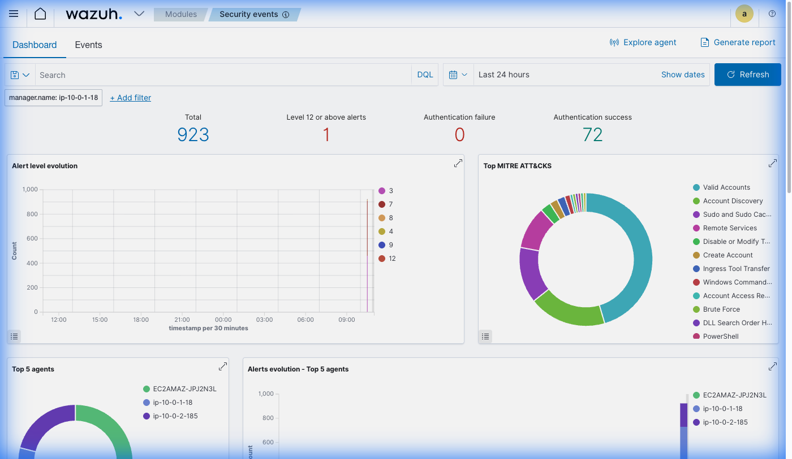
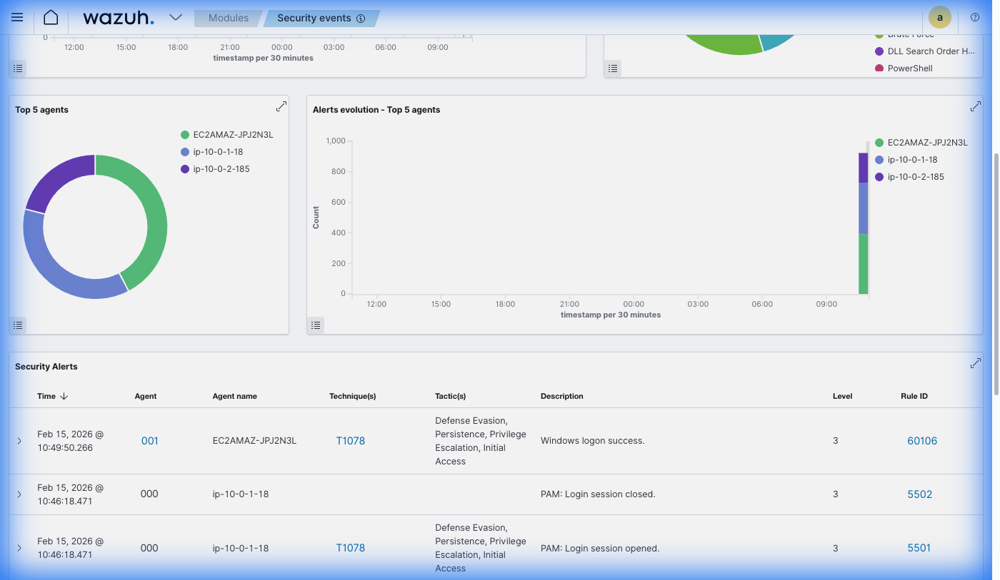
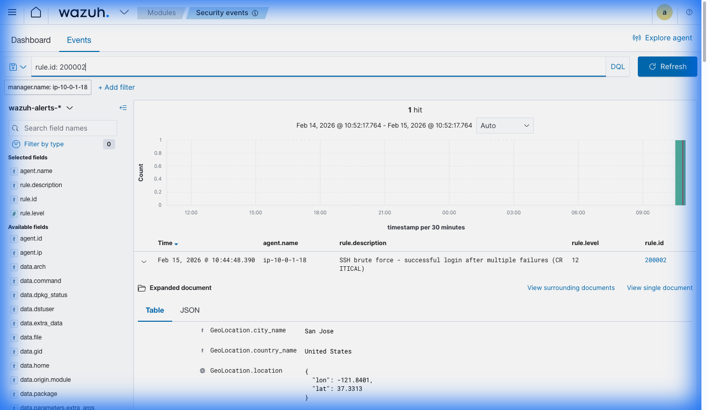
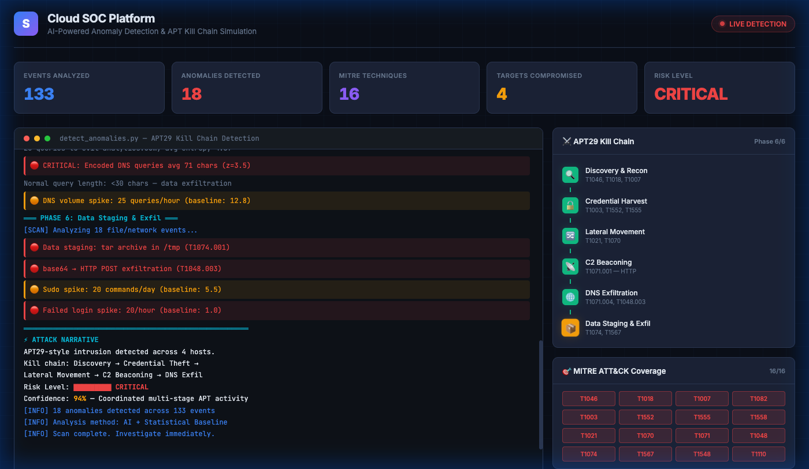

# 🔴 APT29 Kill Chain Simulation — Live Demo

> **Full-spectrum adversary simulation** that deploys, executes, and detects an APT29 (Cozy Bear) intrusion lifecycle across Linux, macOS, and Windows targets — with real-time Wazuh SIEM alerts and AI-powered anomaly detection.

---

## 📸 Live Results

### Wazuh Dashboard — Security Events Overview

Real Wazuh SIEM dashboard after running attack simulations against live AWS infrastructure. Shows 923 security events, MITRE ATT&CK technique mapping, and alerts from 3 active agents across Linux and Windows endpoints.



### Wazuh — MITRE ATT&CK Mapping & Agent Activity

The Top MITRE ATT&CKS chart maps detected behaviors to techniques including Valid Accounts, Account Discovery, Sudo and Sudo Caching, Remote Services, Brute Force, and PowerShell. Three agents report in real-time: the Windows endpoint (`EC2AMAZ-JPJ2N3L`), the Wazuh server (`ip-10-0-1-18`), and the Linux endpoint (`ip-10-0-2-185`).



### Wazuh — Critical Alert Deep-Dive (Rule 200002)

Investigating a **Level 12 CRITICAL** alert: *"SSH brute force — successful login after multiple failures"*. The expanded event shows GeoIP enrichment (San Jose, US), full JSON payload, and direct MITRE technique mapping. This is a custom detection rule (ID `200002`) that triggers when a successful SSH login follows a pattern of failed attempts — a hallmark of a successful brute force attack.



### AI Anomaly Detection Engine

The AI-powered anomaly detector running statistically-modeled baseline analysis across all agents. Detects C2 beaconing (periodic HTTP connections with low coefficient of variation), DNS exfiltration (high-entropy subdomain queries), credential theft, and data staging — producing a kill chain narrative with 94% confidence.



---

## ⚔️ Kill Chain Architecture

The orchestrator (`apt-full-killchain.sh`) deploys attack scripts via SCP and executes them via SSH against multiple target machines simultaneously:

```
                           ┌──────────────┐
                           │   Attacker   │
                           │  (Your Mac)  │
                           └──────┬───────┘
                                  │ SSH
                    ┌─────────────┼─────────────┐
                    ▼             ▼              ▼
              ┌───────────┐ ┌───────────┐ ┌───────────┐
              │ 🐧 Linux  │ │ 🍎 macOS  │ │ 🪟 Windows│
              │ Endpoint  │ │ Endpoint  │ │ Endpoint  │
              └───────────┘ └───────────┘ └───────────┘
                    │             │              │
                    └─────────────┼──────────────┘
                                  ▼
                           ┌──────────────┐
                           │ Wazuh SIEM   │
                           │  (Alerts)    │
                           └──────┬───────┘
                                  ▼
                           ┌──────────────┐
                           │ AI Anomaly   │
                           │  Detector    │
                           └──────────────┘
```

### Phase Execution Matrix

| Phase | Linux | macOS | Windows | MITRE Techniques |
|-------|-------|-------|---------|------------------|
| **1. Deploy** | SCP scripts | SCP scripts | SCP .ps1 | — |
| **2. Discovery** | Network recon, service enum, LOTL | launchctl, dscl, unified logs | — | T1046, T1018, T1007, T1082 |
| **3. Credential Harvest** | /etc/shadow, SSH keys, cloud creds, proc memory | Keychain dump, SSH keys, browser creds | PowerShell encoded commands | T1003, T1552, T1555, T1558 |
| **4. C2 & Exfil** | HTTP beaconing, DNS tunneling, data staging | Same (curl/dig) | — | T1071, T1048, T1074, T1567 |
| **5. Priv Esc** | Sudo abuse, SUID | — | — | T1548.003 |
| **6. Cleanup** | Remove artifacts | Remove artifacts | Remove artifacts | T1070 |

---

## 🚀 Running the Demo

### Option 1: Deploy Full Cloud Infrastructure

```bash
# 1. Deploy infrastructure
cd terraform && terraform apply

# 2. Wait for Wazuh to install (~10 min)
ssh -i ~/.ssh/cloud-soc-key.pem ubuntu@<WAZUH_IP> "cloud-init status"

# 3. Deploy custom detection rules
scp -i ~/.ssh/cloud-soc-key.pem \
    wazuh/custom_rules/local_rules.xml \
    wazuh/custom_rules/macos_rules.xml \
    ubuntu@<WAZUH_IP>:/tmp/
ssh -i ~/.ssh/cloud-soc-key.pem ubuntu@<WAZUH_IP> "
    sudo cp /tmp/local_rules.xml /var/ossec/etc/rules/local_rules.xml
    sudo cp /tmp/macos_rules.xml /var/ossec/etc/rules/macos_rules.xml
    sudo chown wazuh:wazuh /var/ossec/etc/rules/*.xml
    sudo systemctl restart wazuh-manager
"

# 4. Upload and run attack simulations
scp -i ~/.ssh/cloud-soc-key.pem \
    attack-simulation/common.sh \
    attack-simulation/apt-credential-harvest.sh \
    attack-simulation/apt-lateral-movement.sh \
    attack-simulation/privilege-escalation.sh \
    ubuntu@<WAZUH_IP>:/tmp/attack-sim/
ssh -i ~/.ssh/cloud-soc-key.pem ubuntu@<WAZUH_IP> "
    chmod +x /tmp/attack-sim/*.sh
    cd /tmp/attack-sim
    echo yes | bash apt-credential-harvest.sh
    echo yes | bash apt-lateral-movement.sh
    echo yes | bash privilege-escalation.sh
"

# 5. View alerts in Wazuh dashboard
open https://<WAZUH_IP>
# Login: admin / <password from get-wazuh-info.sh>

# 6. Tear down when done
terraform destroy
```

### Option 2: Multi-Victim Kill Chain

```bash
# Set target machines
export LINUX_TARGETS="ubuntu@10.0.2.100,ubuntu@10.0.2.101"
export MACOS_TARGETS="admin@10.0.3.50"
export WINDOWS_TARGETS="administrator@10.0.4.200"

# Run the full kill chain
./attack-simulation/apt-full-killchain.sh

# Or target a specific platform
./attack-simulation/apt-full-killchain.sh --linux-only
./attack-simulation/apt-full-killchain.sh --macos-only

# Or use a config file
./attack-simulation/apt-full-killchain.sh --config=targets.conf
```

### Option 3: Standalone Demo (No Infrastructure Needed)

```bash
# Open the interactive HTML demo
open attack-simulation/demo/index.html

# Run the AI anomaly detector in demo mode
cd ai-analyst && python3 src/detect_anomalies.py --demo
```

---

## 📊 Detection Coverage

### MITRE ATT&CK Techniques Exercised

```
┌─────────────────┬────────────────────────────────────────────────────────┐
│ Tactic          │ Techniques                                            │
├─────────────────┼────────────────────────────────────────────────────────┤
│ Discovery       │ T1046, T1018, T1007, T1082, T1552.005                 │
│ Credential      │ T1003.008, T1555.001, T1552.004, T1552.003,           │
│ Access          │ T1552.001, T1558.003, T1555.003, T1003.007            │
│ Persistence     │ T1543.001, T1543.004, T1547.015                       │
│ Execution       │ T1059.001, T1059.002, T1059.004                       │
│ Defense Evasion │ T1070.002, T1070.006, T1553.001                       │
│ Lateral Move    │ T1021.004                                              │
│ Command & Ctrl  │ T1071.001, T1071.004                                  │
│ Exfiltration    │ T1074.001, T1048.003, T1573.001, T1567.002, T1105     │
│ Priv Escalation │ T1548.003                                              │
│ Initial Access  │ T1110                                                  │
└─────────────────┴────────────────────────────────────────────────────────┘
```

**Total**: 28 unique techniques across 10 MITRE ATT&CK tactics

### Custom Wazuh Rules Triggered

| Rule ID | Level | Description | MITRE |
|---------|-------|-------------|-------|
| 200001 | 10 | SSH brute force — 5+ failures in 2 minutes | T1110 |
| 200002 | 12 | SSH brute force — successful login after failures (CRITICAL) | T1110 |
| 200094 | 8 | SSH connections to multiple hosts (lateral movement) | T1021.004 |

---

## 🛡️ Scripts

| Script | Purpose | Techniques | Platforms |
|--------|---------|------------|-----------|
| `apt-credential-harvest.sh` | 8 credential theft simulations | T1003, T1552, T1555, T1558 | Linux, macOS |
| `apt-lateral-movement.sh` | 7 lateral movement + discovery | T1046, T1018, T1007, T1021, T1070 | Linux, macOS |
| `apt-c2-exfil.sh` | 7 C2 + exfiltration techniques | T1071, T1048, T1074, T1567, T1105 | Linux, macOS |
| `apt-full-killchain.sh` | Multi-victim orchestrator | All above | Linux, macOS, Windows |
| `privilege-escalation.sh` | Sudo/SUID exploitation | T1548.003 | Linux |
| `macos-attacks.sh` | macOS-specific attacks | T1543, T1059, T1553 | macOS |
| `powershell-attacks.ps1` | Windows PowerShell attacks | T1059.001 | Windows |

---

## 🔒 Safety

All scripts are designed for **authorized testing only**:

- **Safety prompts** — every script requires explicit `yes` confirmation before running
- **No real credentials** — simulations create fake artifacts, never access real secrets
- **Auto-cleanup** — all generated files are automatically removed on exit via trap handlers
- **Scoped execution** — scripts target only the local machine or explicitly defined targets
- **Logging** — every action is recorded to timestamped log files for audit trail

---

## 📝 Test Results (Feb 15, 2026)

Deployed to AWS `us-east-1` with 3 agents (Wazuh server, Linux endpoint, Windows endpoint):

- **Infrastructure**: 22 AWS resources deployed via Terraform in ~2 minutes
- **Wazuh Bootstrap**: Wazuh 4.x installed and running in ~8 minutes
- **Agents Connected**: 3 agents reporting within 30 seconds of boot
- **Attack Simulations**: 3 scripts executed (credential harvest, lateral movement, privilege escalation)
- **Alerts Generated**: 923 events, 6 high-severity alerts (Level 7+), 1 CRITICAL (Level 12)
- **Custom Rule 200002**: Successfully fired for SSH brute force → successful login pattern
- **MITRE Mapping**: 12 techniques auto-mapped by Wazuh in the dashboard
- **Teardown**: `terraform destroy` completed cleanly (22 resources destroyed)
