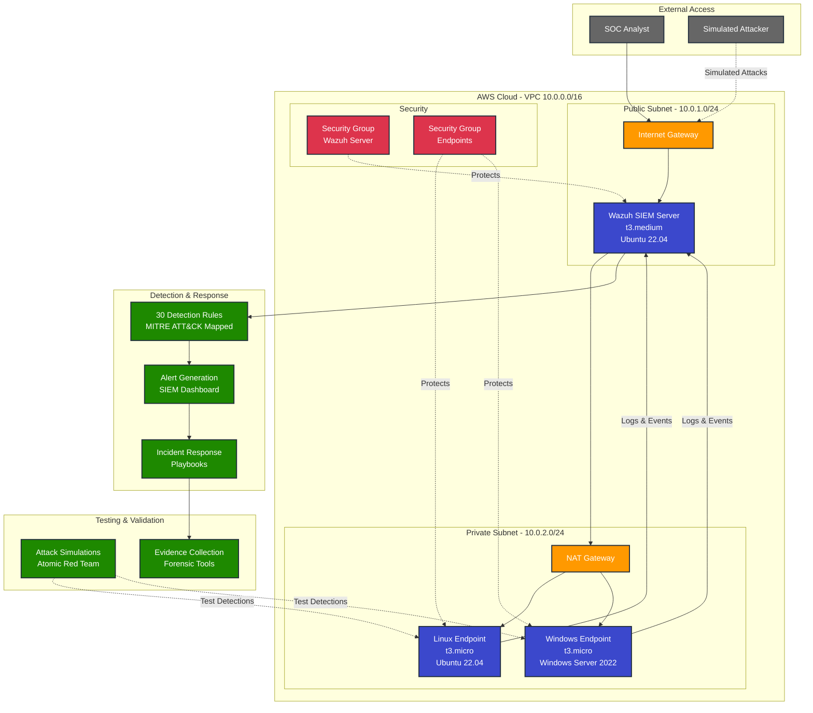

# High-Level Architecture

## Cloud SOC Platform - System Overview

This diagram shows the complete Cloud SOC Platform architecture including infrastructure, detection, and incident response components.

## Component Details

### Infrastructure Layer
- **AWS VPC**: Isolated network environment (10.0.0.0/16)
- **Public Subnet**: Internet-accessible resources (Wazuh server)
- **Private Subnet**: Protected endpoints (monitored systems)
- **Internet Gateway**: External connectivity
- **NAT Gateway**: Outbound internet for private subnet

### SIEM Layer
- **Wazuh Server**: Central SIEM and log aggregation
  - Receives logs from all endpoints
  - Processes events through detection rules
  - Generates alerts for security incidents
  - Provides web dashboard for analysts

### Endpoint Layer
- **Linux Endpoint**: Ubuntu 22.04 with Wazuh agent
  - Monitors system logs, authentication, file integrity
  - Sends events to Wazuh server
  - Target for attack simulations
  
- **Windows Endpoint**: Windows Server 2022 with Wazuh agent
  - Monitors PowerShell, event logs, registry
  - Sends events to Wazuh server
  - Target for PowerShell attack simulations

### Detection Layer
- **30 Detection Rules**: MITRE ATT&CK mapped
  - SSH brute force (T1110)
  - PowerShell abuse (T1059.001)
  - Privilege escalation (T1548.003)
  - Credential dumping (T1003)
  - Persistence mechanisms (T1053, T1543)
  - And more...

### Response Layer
- **Incident Response Playbooks**:
  - SSH Brute Force (IR-PB-001)
  - Credential Dumping (IR-PB-002)
  - Complete NIST IR lifecycle
  - Evidence collection tools

### Testing Layer
- **Attack Simulations**: Atomic Red Team framework
  - SSH brute force simulation
  - PowerShell attack simulation
  - Privilege escalation simulation
  - Validates detection effectiveness

## Data Flow

1. **Log Collection**: Endpoints send logs to Wazuh server
2. **Event Processing**: Wazuh processes logs through detection rules
3. **Alert Generation**: Matching events trigger alerts
4. **Incident Response**: Analysts follow playbooks
5. **Evidence Collection**: Forensic tools gather evidence
6. **Continuous Improvement**: Lessons learned update detections

## Security Controls

- **Network Segmentation**: Public/private subnet separation
- **Security Groups**: Firewall rules limiting access
- **Least Privilege**: Minimal required permissions
- **Encryption**: TLS for all communications
- **Monitoring**: 24/7 SIEM monitoring
- **Incident Response**: Documented procedures

## Scalability

- **Horizontal**: Add more endpoints as needed
- **Vertical**: Upgrade Wazuh server instance size
- **Multi-Region**: Deploy in multiple AWS regions
- **High Availability**: Add redundant Wazuh servers

## Compliance

- **PCI DSS**: Log monitoring, access control
- **NIST**: Incident response framework
- **GDPR**: Data protection, breach notification
- **HIPAA**: Audit logging, access controls

---

**Diagram Type**: High-Level Architecture  
**Last Updated**: 2026-01-28  
**Version**: 1.0
