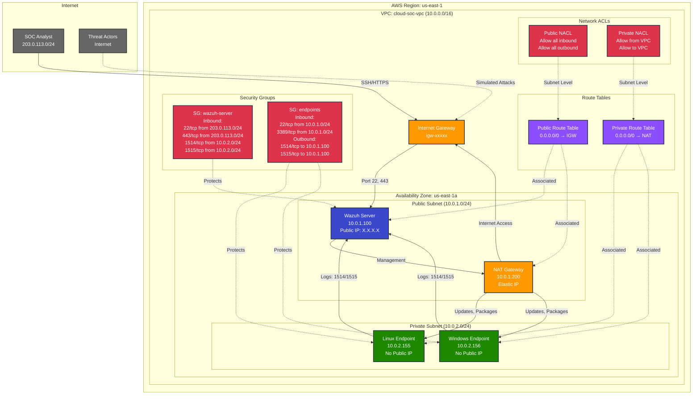
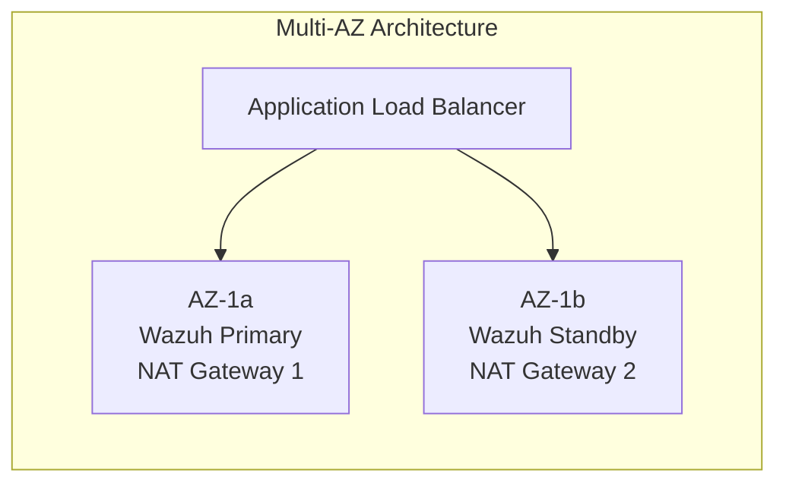

# Network Architecture

## AWS VPC Network Topology

This diagram shows the detailed network architecture including subnets, routing, security groups, and network flows.



## Network Components

### VPC Configuration
- **CIDR Block**: 10.0.0.0/16 (65,536 IP addresses)
- **Region**: us-east-1
- **DNS Hostnames**: Enabled
- **DNS Resolution**: Enabled

### Subnets

#### Public Subnet (10.0.1.0/24)
- **Available IPs**: 251
- **Internet Access**: Direct via Internet Gateway
- **Resources**:
  - Wazuh SIEM Server (10.0.1.100)
  - NAT Gateway (10.0.1.200)
- **Use Case**: Internet-facing services

#### Private Subnet (10.0.2.0/24)
- **Available IPs**: 251
- **Internet Access**: Via NAT Gateway
- **Resources**:
  - Linux Endpoint (10.0.2.155)
  - Windows Endpoint (10.0.2.156)
- **Use Case**: Protected workloads

### Security Groups (Stateful Firewall)

#### Wazuh Server Security Group
```
Inbound Rules:
- SSH (22/tcp) from 203.0.113.0/24 (SOC analysts)
- HTTPS (443/tcp) from 203.0.113.0/24 (Web dashboard)
- Wazuh Agent (1514/tcp) from 10.0.2.0/24 (Log collection)
- Wazuh Registration (1515/tcp) from 10.0.2.0/24 (Agent registration)

Outbound Rules:
- All traffic allowed (default)
```

#### Endpoints Security Group
```
Inbound Rules:
- SSH (22/tcp) from 10.0.1.0/24 (Management from Wazuh subnet)
- RDP (3389/tcp) from 10.0.1.0/24 (Windows management)

Outbound Rules:
- Wazuh Agent (1514/tcp) to 10.0.1.100 (Send logs)
- Wazuh Registration (1515/tcp) to 10.0.1.100 (Agent registration)
- HTTPS (443/tcp) to 0.0.0.0/0 (Updates, packages)
```

### Routing

#### Public Route Table
```
Destination         Target
10.0.0.0/16        local (VPC)
0.0.0.0/0          igw-xxxxx (Internet Gateway)
```

#### Private Route Table
```
Destination         Target
10.0.0.0/16        local (VPC)
0.0.0.0/0          nat-xxxxx (NAT Gateway)
```

## Network Flows

### Log Collection Flow
```
Endpoint (10.0.2.x) → Wazuh Server (10.0.1.100:1514/1515)
```
- Wazuh agents send logs over TCP ports 1514/1515
- Encrypted communication using pre-shared keys
- Continuous real-time log streaming

### Management Access Flow
```
SOC Analyst (203.0.113.x) → Internet Gateway → Wazuh Server (10.0.1.100:443)
```
- HTTPS access to Wazuh web dashboard
- SSH access for server management
- Source IP restricted to analyst network

### Internet Access Flow (Endpoints)
```
Endpoint (10.0.2.x) → NAT Gateway (10.0.1.200) → Internet Gateway → Internet
```
- Endpoints access internet for updates
- NAT provides outbound-only connectivity
- No inbound connections from internet

### Attack Simulation Flow
```
Simulated Attacker → Internet Gateway → Wazuh Server (10.0.1.100:22)
```
- SSH brute force attacks for testing
- Controlled attack simulations
- Validates detection rules

## Security Layers

### Layer 1: Network ACLs (Stateless)
- Subnet-level filtering
- Allow/deny rules by IP and port
- Evaluated in order by rule number

### Layer 2: Security Groups (Stateful)
- Instance-level filtering
- Allow rules only (implicit deny)
- Automatic return traffic allowed

### Layer 3: Host Firewall
- OS-level firewall (iptables, Windows Firewall)
- Additional protection layer
- Configured via Terraform user_data

## High Availability Considerations

### Current Architecture
- Single Availability Zone (us-east-1a)
- Single Wazuh server
- Single NAT Gateway

### HA Improvements (Future)


## Network Monitoring

### VPC Flow Logs
- Capture IP traffic going to/from network interfaces
- Stored in CloudWatch Logs
- Used for security analysis and troubleshooting

### CloudWatch Metrics
- Network in/out
- NAT Gateway metrics
- VPC metrics

### Wazuh Network Monitoring
- Monitors network connections on endpoints
- Detects suspicious network activity
- Alerts on unusual traffic patterns

## Cost Optimization

### Current Costs (Estimated)
- **NAT Gateway**: ~$32/month (0.045/hour + data transfer)
- **Data Transfer**: ~$5/month (varies by usage)
- **Elastic IP**: Free (when associated with running instance)

### Cost Savings Options
- Use VPC endpoints for AWS services (avoid NAT charges)
- Implement VPC peering instead of internet routing
- Schedule non-production resources (stop when not in use)

## Compliance & Best Practices

✅ **Network Segmentation**: Public/private subnet separation  
✅ **Least Privilege**: Minimal security group rules  
✅ **Defense in Depth**: Multiple security layers (NACL + SG + Host)  
✅ **Encryption in Transit**: TLS for all communications  
✅ **Logging**: VPC Flow Logs enabled  
✅ **Monitoring**: CloudWatch + Wazuh SIEM  

---

**Diagram Type**: Network Architecture  
**Last Updated**: 2026-01-28  
**Version**: 1.0
