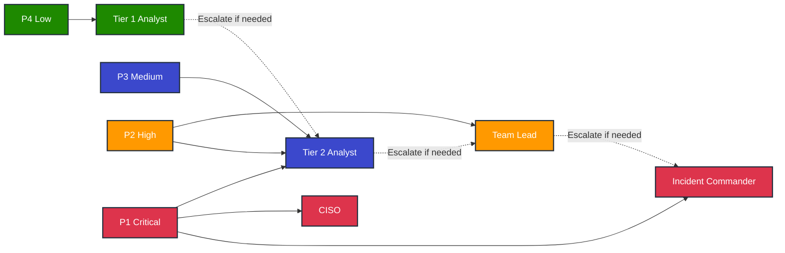
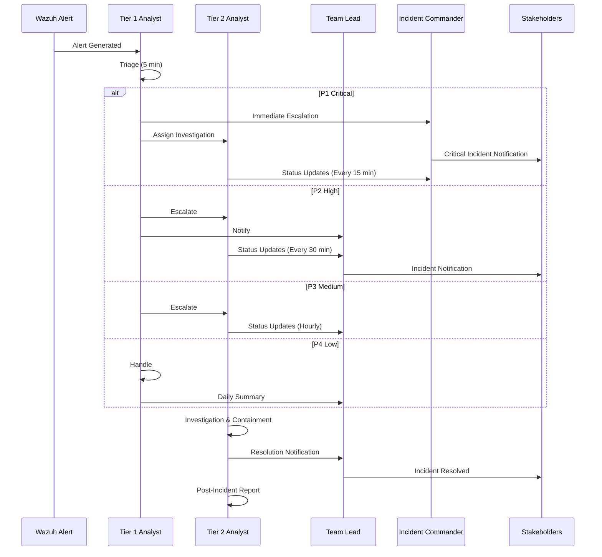

# Incident Response Workflow

## Complete IR Lifecycle - NIST Framework

This diagram shows the complete incident response workflow from detection through post-incident activities.

```mermaid
flowchart TD
    START([Security Event Occurs]) --> DETECT[Detection<br/>Wazuh SIEM]
    
    DETECT --> ALERT{Alert<br/>Generated?}
    ALERT -->|No| LOG[Log for Analysis]
    ALERT -->|Yes| TRIAGE[Phase 1: TRIAGE<br/>5 minutes]
    
    TRIAGE --> SEVERITY{Determine<br/>Severity}
    
    SEVERITY -->|P1 Critical| ESCALATE_P1[Immediate Escalation<br/>Incident Commander + CISO]
    SEVERITY -->|P2 High| ESCALATE_P2[Escalate to Tier 2<br/>+ Team Lead]
    SEVERITY -->|P3 Medium| ESCALATE_P3[Escalate to Tier 2]
    SEVERITY -->|P4 Low| ESCALATE_P4[Tier 1 Review]
    
    ESCALATE_P1 --> ISOLATE[IMMEDIATE ISOLATION<br/>Cut network access]
    ESCALATE_P2 --> INVESTIGATE
    ESCALATE_P3 --> INVESTIGATE
    ESCALATE_P4 --> INVESTIGATE
    
    ISOLATE --> INVESTIGATE[Phase 2: INVESTIGATION<br/>15-30 minutes]
    
    INVESTIGATE --> COLLECT[Collect Evidence<br/>Logs, Memory, Disk]
    COLLECT --> ANALYZE[Analyze Indicators<br/>IOCs, TTPs]
    ANALYZE --> SCOPE[Determine Scope<br/>Affected Systems]
    
    SCOPE --> CONTAIN[Phase 3: CONTAINMENT<br/>10-20 minutes]
    
    CONTAIN --> IMMEDIATE[Immediate Containment<br/>Block IPs, Kill Processes]
    IMMEDIATE --> SHORT_TERM[Short-term Containment<br/>Disable Accounts, Isolate Systems]
    SHORT_TERM --> LONG_TERM[Long-term Containment<br/>Patch, Harden, Monitor]
    
    LONG_TERM --> ERADICATE[Phase 4: ERADICATION<br/>20-40 minutes]
    
    ERADICATE --> REMOVE[Remove Threats<br/>Malware, Backdoors]
    REMOVE --> PATCH[Patch Vulnerabilities<br/>Update Systems]
    PATCH --> ROTATE[Rotate Credentials<br/>All Compromised Accounts]
    
    ROTATE --> RECOVER[Phase 5: RECOVERY<br/>30-60 minutes]
    
    RECOVER --> REBUILD{System<br/>Rebuild<br/>Needed?}
    REBUILD -->|Yes| RESTORE_BACKUP[Restore from<br/>Clean Backup]
    REBUILD -->|No| HARDEN[Harden System<br/>Security Controls]
    
    RESTORE_BACKUP --> VERIFY
    HARDEN --> VERIFY[Verify Integrity<br/>System Checks]
    
    VERIFY --> RESUME[Resume Services<br/>Gradual Restoration]
    RESUME --> MONITOR[Enhanced Monitoring<br/>Watch for Reinfection]
    
    MONITOR --> POST[Phase 6: POST-INCIDENT<br/>1-2 hours]
    
    POST --> DOCUMENT[Document Incident<br/>Complete Report]
    DOCUMENT --> LESSONS[Lessons Learned<br/>Team Review]
    LESSONS --> IMPROVE[Improve Defenses<br/>Update Playbooks]
    
    IMPROVE --> METRICS[Collect Metrics<br/>MTTD, MTTA, MTTR]
    METRICS --> END([Incident Closed])
    
    %% Parallel processes
    INVESTIGATE -.->|Continuous| COMMUNICATE[Stakeholder<br/>Communication]
    CONTAIN -.->|Continuous| COMMUNICATE
    ERADICATE -.->|Continuous| COMMUNICATE
    RECOVER -.->|Continuous| COMMUNICATE
    
    COLLECT -.->|Maintain| CHAIN[Chain of Custody<br/>Evidence Tracking]
    ANALYZE -.->|Maintain| CHAIN
    
    %% Styling
    classDef critical fill:#DD344C,stroke:#232F3E,stroke-width:3px,color:#fff
    classDef high fill:#FF9900,stroke:#232F3E,stroke-width:2px,color:#fff
    classDef normal fill:#3B48CC,stroke:#232F3E,stroke-width:2px,color:#fff
    classDef success fill:#1E8900,stroke:#232F3E,stroke-width:2px,color:#fff
    classDef decision fill:#8C4FFF,stroke:#232F3E,stroke-width:2px,color:#fff
    
    class ISOLATE,ESCALATE_P1,REMOVE critical
    class ESCALATE_P2,IMMEDIATE,SHORT_TERM high
    class TRIAGE,INVESTIGATE,CONTAIN,ERADICATE,RECOVER,POST normal
    class VERIFY,RESUME,IMPROVE,END success
    class ALERT,SEVERITY,REBUILD decision
```

## Phase Details

### Phase 1: Triage (5 minutes)
**Objective**: Quickly assess the incident and determine severity

**Activities**:
- Review alert details in Wazuh dashboard
- Answer initial assessment questions
- Determine severity (P1/P2/P3/P4)
- Escalate according to severity matrix
- Take immediate containment actions if P1

**Outputs**:
- Severity classification
- Initial incident ID
- Escalation notification sent

**Metrics**:
- MTTA (Mean Time to Acknowledge): < 5 minutes

---

### Phase 2: Investigation (15-30 minutes)
**Objective**: Understand the scope and impact of the incident

**Activities**:
- Collect evidence (logs, memory dumps, network captures)
- Analyze indicators of compromise (IOCs)
- Identify attack techniques (MITRE ATT&CK)
- Determine affected systems
- Check for lateral movement
- Assess data access/exfiltration

**Outputs**:
- Evidence package with chain of custody
- List of affected systems
- Timeline of attacker activities
- IOC list (IPs, hashes, domains)

**Metrics**:
- MTTI (Mean Time to Investigate): < 30 minutes

---

### Phase 3: Containment (10-20 minutes)
**Objective**: Stop the incident from spreading

**Immediate Containment** (< 5 minutes):
- Block attacker IP addresses
- Kill malicious processes
- Disable compromised accounts
- Isolate affected systems

**Short-term Containment** (5-10 minutes):
- Update firewall rules
- Revoke active sessions
- Implement temporary access controls
- Deploy detection signatures

**Long-term Containment** (10-20 minutes):
- Patch vulnerable systems
- Implement fail2ban/rate limiting
- Harden configurations
- Deploy enhanced monitoring

**Outputs**:
- Containment actions log
- Updated firewall rules
- Disabled accounts list

**Metrics**:
- MTTC (Mean Time to Contain): < 1 hour

---

### Phase 4: Eradication (20-40 minutes)
**Objective**: Remove the threat completely

**Activities**:
- Remove malware and backdoors
- Delete unauthorized accounts
- Remove persistence mechanisms
- Patch vulnerabilities
- Rotate all potentially compromised credentials
- Update security controls

**Outputs**:
- Malware removal confirmation
- Patching report
- Credential rotation log
- Updated security baseline

**Verification**:
- Scan for rootkits
- Verify no malicious processes
- Check for unauthorized changes
- Validate security controls

---

### Phase 5: Recovery (30-60 minutes)
**Objective**: Restore systems to normal operation

**Decision Point**: Rebuild vs. Harden
- **Rebuild**: If system integrity cannot be verified
- **Harden**: If confident threat is eradicated

**Rebuild Path**:
1. Restore from last known-good backup
2. Apply all security patches
3. Verify integrity
4. Restore data (after malware scan)
5. Test functionality

**Harden Path**:
1. Apply security hardening
2. Update configurations
3. Deploy additional controls
4. Verify integrity
5. Test functionality

**Service Resumption**:
- Gradual restoration of services
- Enhanced monitoring
- User communication
- Validation testing

**Outputs**:
- Restored/hardened systems
- Updated security controls
- Service resumption confirmation

**Metrics**:
- MTTR (Mean Time to Recover): < 4 hours

---

### Phase 6: Post-Incident Activity (1-2 hours)
**Objective**: Learn and improve

**Activities**:
- Complete incident report
- Conduct lessons learned session
- Update playbooks and procedures
- Implement preventive measures
- Collect and analyze metrics
- Share threat intelligence

**Incident Report Sections**:
- Executive summary
- Detailed timeline
- Impact assessment
- Root cause analysis
- Response actions
- Lessons learned
- Recommendations

**Lessons Learned Questions**:
1. What happened?
2. Why did it happen?
3. What went well?
4. What could be improved?
5. What actions will we take?

**Outputs**:
- Complete incident report
- Updated playbooks
- Preventive measures implemented
- Metrics dashboard updated
- Threat intelligence shared

**Metrics Collected**:
- MTTD (Mean Time to Detect)
- MTTA (Mean Time to Acknowledge)
- MTTI (Mean Time to Investigate)
- MTTC (Mean Time to Contain)
- MTTR (Mean Time to Recover)

---

## Severity-Based Response Times

| Severity | Response Time | Investigation | Containment | Recovery | Total MTTR |
|----------|---------------|---------------|-------------|----------|------------|
| **P1 (Critical)** | < 15 min | 10 min | 10 min | 30 min | **< 1 hour** |
| **P2 (High)** | < 30 min | 30 min | 20 min | 1 hour | **< 2 hours** |
| **P3 (Medium)** | < 1 hour | 1 hour | 30 min | 2 hours | **< 4 hours** |
| **P4 (Low)** | < 4 hours | 2 hours | 1 hour | 4 hours | **< 8 hours** |

## Escalation Matrix

## Communication Flow

## Continuous Improvement Loop

```mermaid
graph LR
    INCIDENT[Incident Occurs] --> RESPOND[Respond Using Playbook]
    RESPOND --> DOCUMENT[Document Actions]
    DOCUMENT --> REVIEW[Lessons Learned]
    REVIEW --> IDENTIFY[Identify Improvements]
    IDENTIFY --> UPDATE[Update Playbooks]
    UPDATE --> TRAIN[Train Team]
    TRAIN --> BETTER[Better Prepared]
    BETTER -.->|Next Incident| INCIDENT
    
    classDef process fill:#3B48CC,stroke:#232F3E,stroke-width:2px,color:#fff
    classDef improve fill:#1E8900,stroke:#232F3E,stroke-width:2px,color:#fff
    
    class INCIDENT,RESPOND,DOCUMENT process
    class REVIEW,IDENTIFY,UPDATE,TRAIN,BETTER improve
```

---

**Diagram Type**: Incident Response Workflow  
**Framework**: NIST SP 800-61r2  
**Last Updated**: 2026-01-28  
**Version**: 1.0
