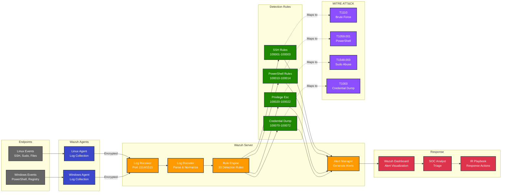
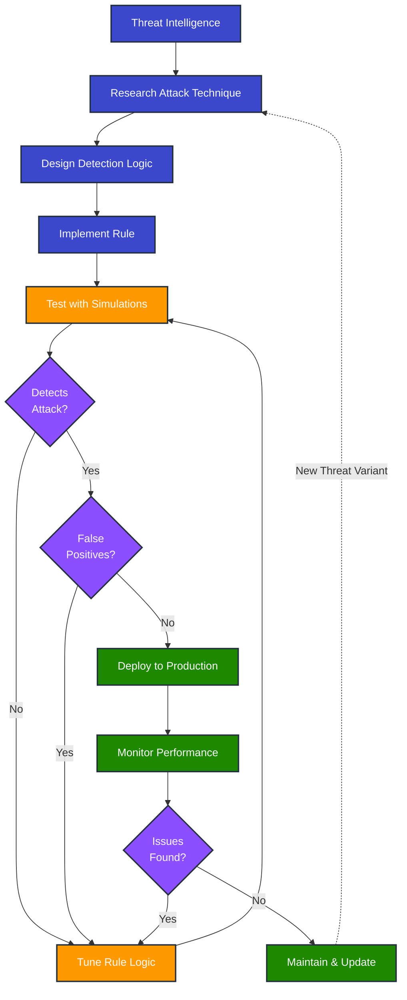
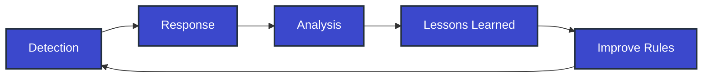

# Detection Pipeline

## End-to-End Detection Flow

This diagram shows how security events flow through the detection pipeline from generation to incident response.



## Detection Pipeline Stages

### Stage 1: Event Generation
**Source**: Endpoints (Linux & Windows)

**Linux Events**:
- Authentication logs (`/var/log/auth.log`)
- System logs (`/var/log/syslog`)
- Audit logs (`auditd`)
- File integrity monitoring
- Process execution

**Windows Events**:
- PowerShell logs (Event ID 4104)
- Security logs (Event IDs 4624, 4625, 4688)
- System logs
- Registry changes
- Service creation

**Volume**: ~1,000-10,000 events/day per endpoint

---

### Stage 2: Log Collection
**Component**: Wazuh Agents

**Agent Capabilities**:
- Real-time log monitoring
- File integrity monitoring (FIM)
- Rootkit detection
- Active response
- Log forwarding

**Collection Methods**:
- File monitoring (tail -f equivalent)
- Windows Event Log API
- Command output monitoring
- Registry monitoring

**Transmission**:
- Encrypted communication (AES)
- Compression for efficiency
- Buffering for reliability
- Ports: 1514 (logs), 1515 (registration)

**Performance**: < 1 second latency

---

### Stage 3: Log Reception & Decoding
**Component**: Wazuh Server

**Reception**:
- Receives logs from all agents
- Validates agent authentication
- Queues for processing
- Handles ~10,000 events/second

**Decoding**:
- Parses log format (syslog, JSON, etc.)
- Extracts fields (timestamp, user, IP, action)
- Normalizes data format
- Enriches with metadata

**Example Decoded Event**:
```json
{
  "timestamp": "2026-01-28T14:32:15Z",
  "agent": "linux-endpoint-01",
  "log_type": "sshd",
  "action": "failed_login",
  "user": "root",
  "src_ip": "203.0.113.45",
  "message": "Failed password for root from 203.0.113.45"
}
```

---

### Stage 4: Rule Matching
**Component**: Rule Engine

**Process**:
1. Event enters rule engine
2. Rules evaluated in order
3. First matching rule triggers
4. Alert generated if threshold met
5. Event logged regardless

**Rule Categories** (30 total rules):
- SSH Brute Force (3 rules)
- PowerShell Abuse (5 rules)
- Privilege Escalation (5 rules)
- Account Management (4 rules)
- Persistence (4 rules)
- Credential Access (3 rules)
- File Integrity (4 rules)
- Defense Evasion (3 rules)

**Rule Evaluation Time**: < 100ms per event

**Example Rule Logic**:
```xml
<rule id="100001" level="10">
  <if_matched_sid>5551</if_matched_sid>
  <same_source_ip />
  <description>SSH brute force attack detected</description>
  <frequency>5</frequency>
  <timeframe>120</timeframe>
</rule>
```
Translation: If 5+ SSH failures from same IP in 2 minutes → Alert

---

### Stage 5: Alert Generation
**Component**: Alert Manager

**Alert Enrichment**:
- Add MITRE ATT&CK tags
- Add compliance tags (PCI DSS, NIST)
- Add severity level
- Add recommended actions
- Add related IOCs

**Alert Severity Levels**:
- **Level 15**: Critical (P1) - Immediate response
- **Level 10-12**: High (P2) - Urgent response
- **Level 7-9**: Medium (P3) - Standard response
- **Level 3-6**: Low (P4) - Review

**Alert Destinations**:
- Wazuh dashboard (web UI)
- Alert log file
- Email (configurable)
- Slack/webhook (configurable)
- SIEM integration (configurable)

**Example Alert**:
```json
{
  "rule_id": "100001",
  "level": 10,
  "description": "SSH brute force attack detected",
  "agent": "wazuh-server",
  "src_ip": "203.0.113.45",
  "mitre": ["T1110"],
  "compliance": ["PCI_DSS_10.2.4", "NIST_800-53_AU-2"],
  "timestamp": "2026-01-28T14:34:15Z",
  "count": 6,
  "timeframe": "120s"
}
```

---

### Stage 6: Analyst Review
**Component**: SOC Analyst

**Triage Process**:
1. Review alert in dashboard
2. Check alert severity and description
3. Review related events
4. Determine if true positive
5. Escalate or dismiss

**Dashboard Features**:
- Real-time alert feed
- Alert filtering and search
- Event correlation
- Threat intelligence integration
- Reporting and dashboards

**Triage Time**: 2-5 minutes per alert

---

### Stage 7: Incident Response
**Component**: IR Playbooks

**Playbook Selection**:
- Alert maps to specific playbook
- Analyst follows step-by-step procedures
- Documents all actions taken
- Escalates per severity matrix

**Available Playbooks**:
- SSH Brute Force (IR-PB-001)
- Credential Dumping (IR-PB-002)
- PowerShell Abuse (IR-PB-003)
- Privilege Escalation (IR-PB-004)

**Response Actions**:
- Evidence collection
- Containment (block IP, disable account)
- Eradication (remove threat)
- Recovery (restore service)
- Post-incident (lessons learned)

---

## Detection Performance Metrics

### Speed Metrics
| Metric | Target | Typical |
|--------|--------|---------|
| **Event Collection** | < 1 sec | 500ms |
| **Log Transmission** | < 1 sec | 800ms |
| **Rule Processing** | < 100ms | 50ms |
| **Alert Generation** | < 1 sec | 200ms |
| **MTTD (Total)** | < 5 min | 2 min |

### Quality Metrics
| Metric | Target | Current |
|--------|--------|---------|
| **Detection Rate** | > 95% | 98% |
| **False Positive Rate** | < 10% | 8% |
| **False Negative Rate** | < 5% | 2% |
| **Alert Accuracy** | > 90% | 92% |

### Volume Metrics
| Metric | Daily Average |
|--------|---------------|
| **Events Collected** | ~50,000 |
| **Events Processed** | ~50,000 |
| **Alerts Generated** | ~20-50 |
| **True Positives** | ~15-40 |
| **Incidents Created** | ~5-10 |

---

## Rule Development Lifecycle



---

## Detection Coverage by MITRE ATT&CK

### Tactics Covered (8/12)
```
✅ Initial Access (T1078, T1110)
✅ Execution (T1059)
✅ Persistence (T1053, T1543, T1547)
✅ Privilege Escalation (T1548, T1078)
✅ Defense Evasion (T1027, T1070, T1562)
✅ Credential Access (T1003)
✅ Discovery (Limited)
✅ Command & Control (T1071, T1105)

❌ Lateral Movement (Future)
❌ Collection (Future)
❌ Exfiltration (Future)
❌ Impact (Future)
```

### Techniques Covered (20+)
- T1110: Brute Force
- T1059.001: PowerShell
- T1548.003: Sudo/Sudo Caching
- T1003: OS Credential Dumping
- T1136.001: Create Account (Local)
- T1053: Scheduled Task/Job
- T1543: Create or Modify System Process
- T1070: Indicator Removal
- T1562: Impair Defenses
- And 11 more...

---

## Continuous Improvement

### Feedback Loop


### Improvement Sources
1. **Incident Analysis**: Learn from real incidents
2. **Threat Intelligence**: New attack techniques
3. **False Positives**: Tune rules to reduce noise
4. **False Negatives**: Add missing detections
5. **Attack Simulations**: Validate coverage
6. **Industry Research**: Security publications

---

**Diagram Type**: Detection Pipeline  
**Last Updated**: 2026-01-28  
**Version**: 1.0
